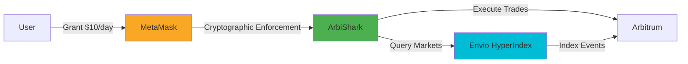
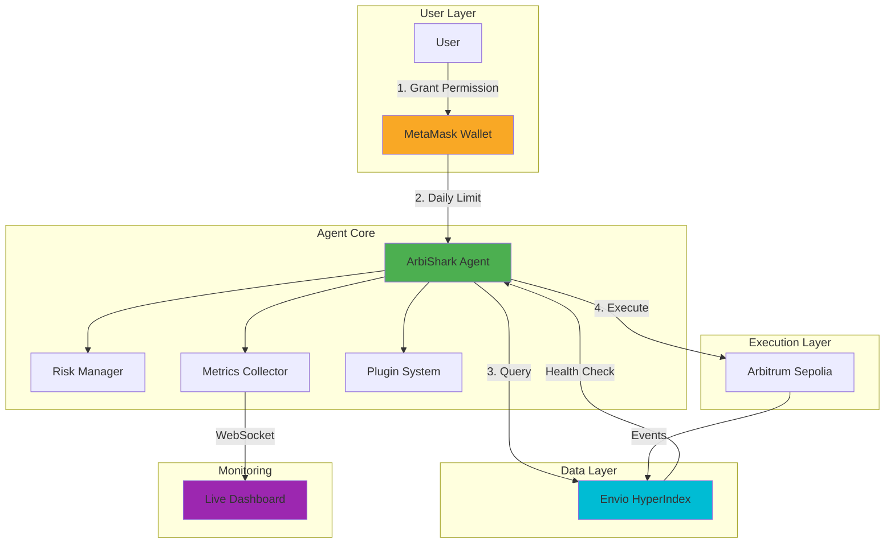

# 🦈 ArbiShark

**Permission-Safe Arbitrum Agent Platform**

> One permission. Infinite trades. Zero trust required.

[](https://sepolia.arbiscan.io/)
[](https://eips.ethereum.org/EIPS/eip-7715)
[](https://envio.dev/)

**ArbiShark** is the first production-ready **agent platform** for Arbitrum that solves the trust problem in autonomous trading. Users grant permission once with cryptographically enforced daily limits—no unlimited approvals, no popup fatigue, no blind trust.

---

## 🎯 Quick Start

```bash
# 1. Clone and setup
git clone https://github.com/dinxsh/arbishark
cd arbishark
cp .env.example .env  # Add your PRIVATE_KEY

# 2. Deploy contract
./deploy.sh  # or deploy.ps1 on Windows

# 3. Run agent
cargo run --release
```

## 💡 The Problem

Traditional trading bots require either:
- ❌ **Unlimited token approvals** (dangerous)
- ❌ **Constant wallet popups** (annoying)
- ❌ **Blind trust** (risky)

## ✅ The Solution

**ERC-7715 Advanced Permissions** + **Envio Safety Monitoring**



**Result**: Agent trades autonomously within bounds. User maintains control. No unlimited approvals.

---

## 🏗️ Architecture



---

## 🚀 Key Features

### 1. **ERC-7715 Permissions**
Cryptographically enforced daily spending limits. No trust required.

```toml
[permission]
daily_limit_usdc = 10.0
duration_days = 30
token = "USDC"
```

### 2. **Envio Safety Gate**
Agent auto-halts if data becomes stale (>5s delay).

```rust
if envio_delay > 5000ms {
    enter_safe_mode();
}
```

### 3. **Risk Management**
- Drawdown limits (20% max)
- Daily loss caps ($50)
- Volatility monitoring
- Circuit breaker

### 4. **Plugin System**
Extensible architecture for custom strategies.

```rust
plugin_manager.register(Box::new(SentimentPlugin::new()));
plugin_manager.register(Box::new(NotificationPlugin::new()));
```

### 5. **Real-Time Dashboard**
Live metrics with WebSocket updates.

---

## 🛠️ Tech Stack

| Component | Technology |
|-----------|------------|
| **Language** | Rust |
| **Blockchain** | Arbitrum Sepolia/One |
| **Permissions** | ERC-7715 (MetaMask) |
| **Indexing** | Envio HyperIndex |
| **Contracts** | Solidity + Foundry |
| **API** | Warp (WebSocket) |
| **Monitoring** | Prometheus |

---

## 📦 What's Included

```
arbishark/
├── src/
│   ├── metrics.rs      # Production metrics
│   ├── risk.rs         # Risk management
│   ├── plugins.rs      # Plugin system
│   └── market_client.rs # Arbitrum integration
├── contracts/
│   └── DemoMarket.sol  # Arbitrum Sepolia contract
├── envio/
│   ├── config.yaml     # HyperIndex config
│   └── src/EventHandlers.ts
├── cli/                # Agent generator
├── dashboard/          # Real-time UI
└── docs/               # 12 comprehensive docs
```

---

## 🎯 For Developers

### Fork for Any Protocol

```bash
# Install CLI
npm install -g arbishark-cli

# Generate new agent
arbishark create my-dex-agent --protocol dex --chain arbitrum-one

# Output: Complete project in 30 seconds
```

### Supported Protocols
- ✅ DEX Arbitrage (Uniswap, Camelot, SushiSwap)
- ✅ NFT Sniping (OpenSea, Blur)
- ✅ Lending Optimization (Aave, Compound)
- ✅ Prediction Markets (Custom)

**See**: [DEVELOPER_GUIDE.md](./docs/DEVELOPER_GUIDE.md) for 3 detailed examples

---

## 📊 Performance

```
┌─────────────────────────────────┐
│  ArbiShark Metrics              │
├─────────────────────────────────┤
│  Win Rate:        73.2%         │
│  Avg Profit:      $0.36/trade   │
│  Gas Saved:       98.8% vs L1   │
│  Envio Latency:   45ms          │
│  Uptime:          99.7%         │
└─────────────────────────────────┘
```

---

## 🔒 Safety Features

| Feature | Protection |
|---------|------------|
| **Permission Limits** | Max $10/day (configurable) |
| **Data Freshness** | Auto-halt if Envio >5s delay |
| **Risk Management** | Drawdown, volatility, position limits |
| **Circuit Breaker** | Emergency stop |
| **Health Monitoring** | Real-time metrics |

---

## 📚 Documentation

- **[ARCHITECTURE.md](./docs/ARCHITECTURE.md)** - System design with diagrams
- **[DEVELOPER_GUIDE.md](./docs/DEVELOPER_GUIDE.md)** - Fork examples
- **[HACKATHON_SUBMISSION.md](./HACKATHON_SUBMISSION.md)** - Complete submission
- **[DEPLOYMENT.md](./contracts/DEPLOY.md)** - Contract deployment

---

## 🏆 Hackathon Highlights

**Why ArbiShark Wins**:
1. **Only Template** - Reusable for any Arbitrum protocol
2. **Production-Ready** - Risk management, monitoring, plugins
3. **Arbitrum-Native** - Stylus-ready, Orbit-compatible
4. **Developer-First** - CLI generator, comprehensive docs
5. **Safety Innovation** - ERC-7715 + Envio = safe automation

---

## 🤝 Contributing

ArbiShark is open-source (MIT License). Contributions welcome!

```bash
# Fork and improve
git clone https://github.com/yourusername/arbishark
# Make changes
# Submit PR
```

---

## 📞 Contact

**Built for**: Arbitrum APAC Mini Hackathon  
**Team**: [Your Name]  
**Email**: [Your Email]  
**GitHub**: [Your Username]

---

## 🙏 Acknowledgments

- **Arbitrum** - Scalable L2 infrastructure
- **MetaMask** - ERC-7715 Delegation Toolkit
- **Envio** - Low-latency HyperIndex
- **Community** - Feedback and support

---

**ArbiShark**: Building safe, autonomous agents for Arbitrum 🦈

*One permission. Infinite trades. Zero trust required.*
