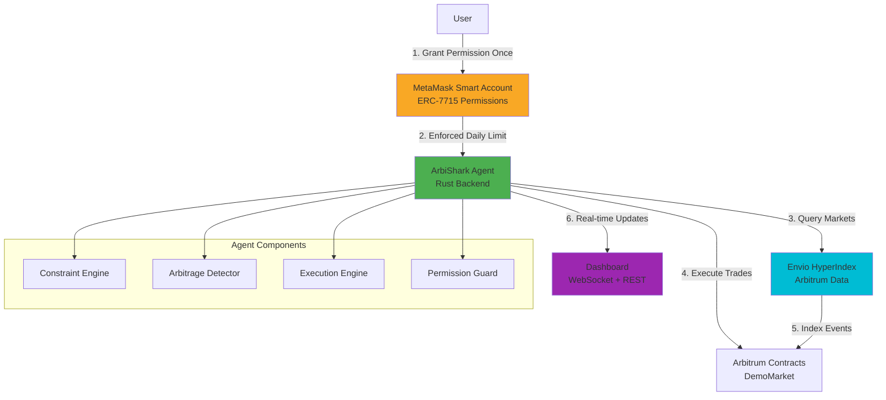
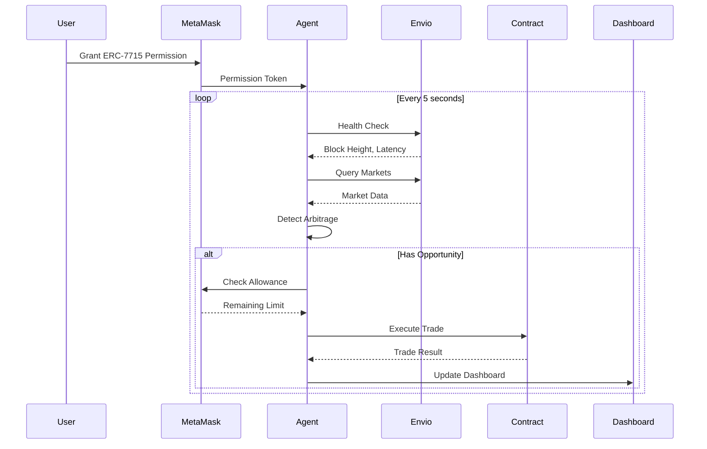
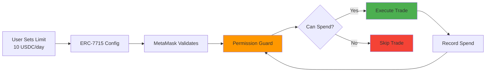
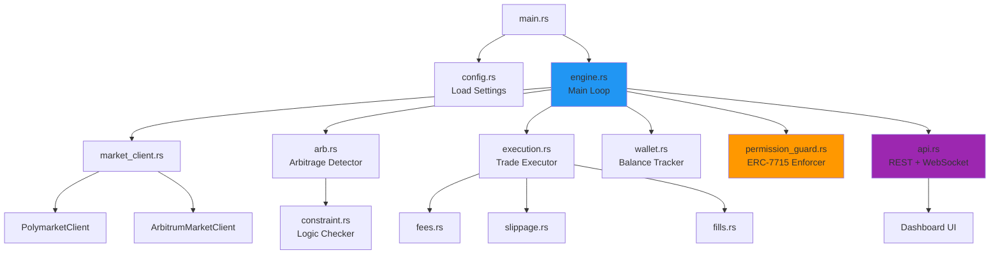
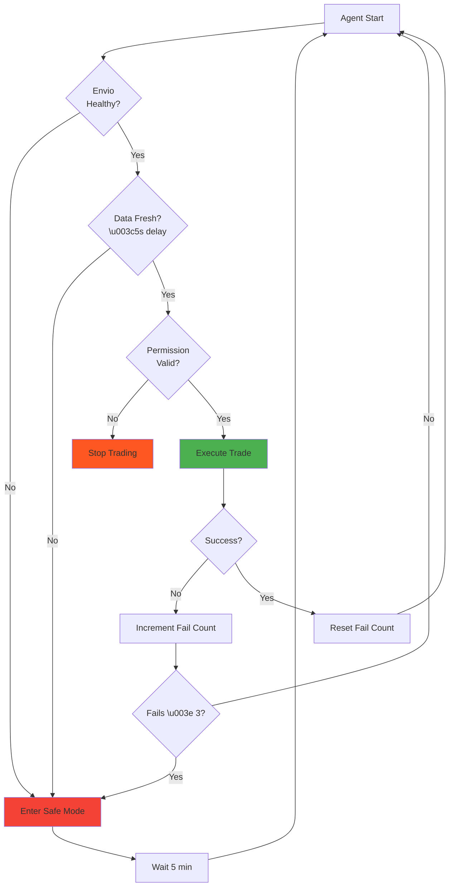
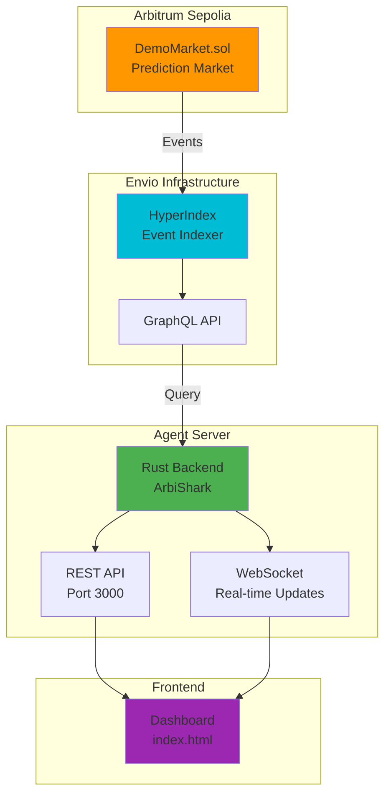
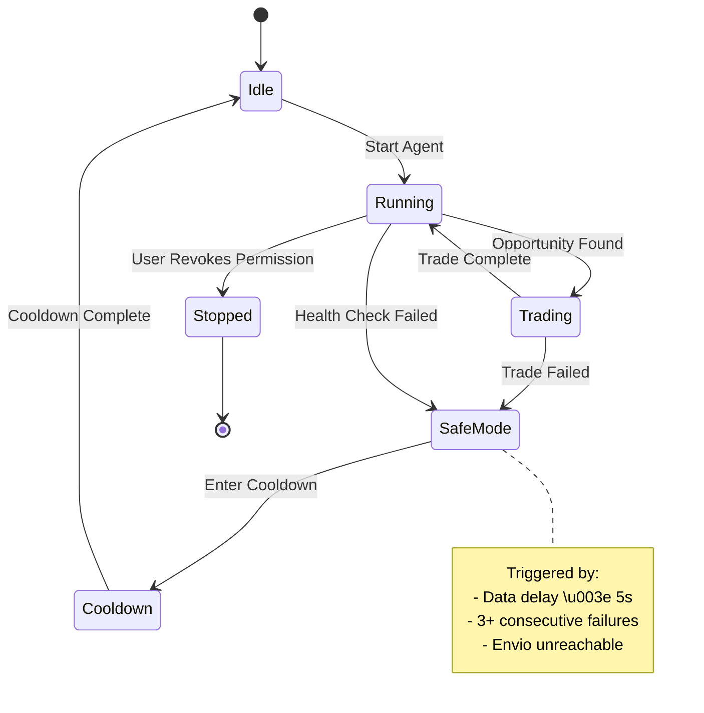

# ArbiShark Architecture

## System Overview

ArbiShark is a permission-safe autonomous trading agent for Arbitrum that uses ERC-7715 Advanced Permissions and Envio HyperIndex for safe, automated arbitrage trading.

## Data Flow

## Permission System

## Component Architecture

## Safety Mechanisms

## Deployment Architecture

## State Management

---

## Key Design Decisions

### 1. Permission-First Architecture
- **Why**: Solves the trust problem in autonomous agents
- **How**: ERC-7715 cryptographic enforcement, not trust-based limits
- **Benefit**: Users maintain control without popup fatigue

### 2. Envio as Safety Gate
- **Why**: Stale data leads to bad trades
- **How**: Health checks every query, automatic halt on delay
- **Benefit**: Safe automation with real-time data guarantees

### 3. Pluggable MarketClient
- **Why**: Template for any Arbitrum protocol
- **How**: Trait-based abstraction, easy to swap implementations
- **Benefit**: Reusable for DEXs, NFTs, games, etc.

### 4. Adaptive Strategy
- **Why**: Intelligent budgeting within limits
- **How**: Conservative/Normal/Aggressive modes based on remaining allowance
- **Benefit**: Maximizes opportunities while respecting constraints

---

## Technology Choices

| Component | Technology | Rationale |
|-----------|------------|-----------|
| **Language** | Rust | Performance, safety, WASM-ready for Stylus |
| **Permissions** | ERC-7715 | Standard for advanced permissions |
| **Indexing** | Envio HyperIndex | Low-latency, Arbitrum-native |
| **API** | Warp (Rust) | Fast, async, WebSocket support |
| **Frontend** | Vanilla HTML/JS | Simple, no build step needed |
| **Deployment** | Arbitrum Sepolia | Testnet for demo, mainnet-ready |

---

## Security Considerations

1. **Permission Enforcement**: All trades go through `PermissionGuard`
2. **Data Validation**: GraphQL errors checked, timeouts enforced
3. **Fail-Safe Defaults**: Agent halts on any uncertainty
4. **No Private Keys in Code**: Environment variables only
5. **Rate Limiting**: Configurable poll intervals
6. **Audit Trail**: All trades logged with timestamps

---

## Scalability

- **Horizontal**: Multiple agents can run independently
- **Vertical**: Single agent handles dozens of markets
- **Data**: Envio scales with Arbitrum network
- **API**: WebSocket for efficient real-time updates

---

## Future Enhancements

1. **Stylus Integration**: On-chain arbitrage verification
2. **Orbit Support**: Multi-chain agent deployment
3. **Advanced Strategies**: ML-based opportunity detection
4. **MEV Protection**: Flashbots-style private transactions
5. **Governance**: DAO-controlled parameter updates
