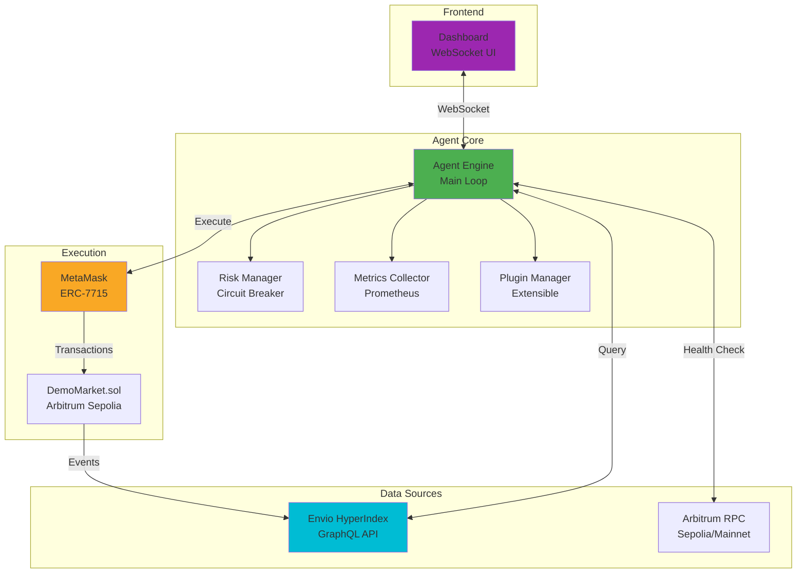
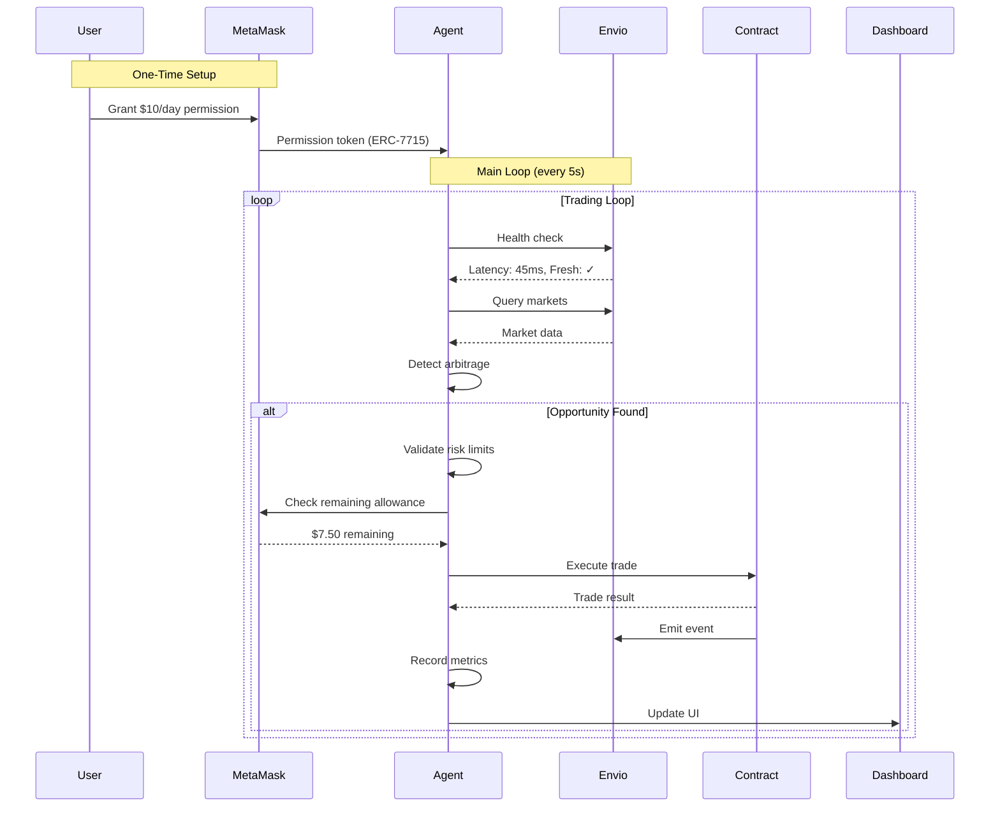
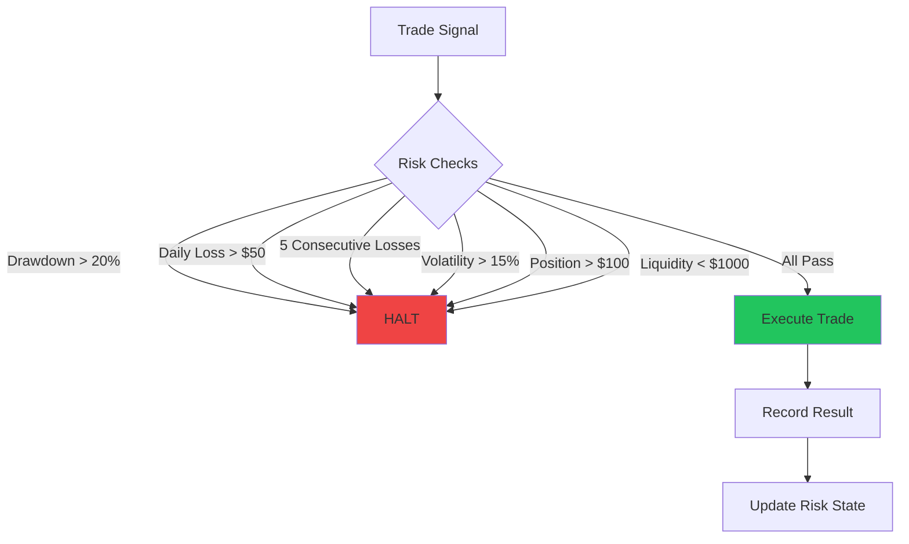
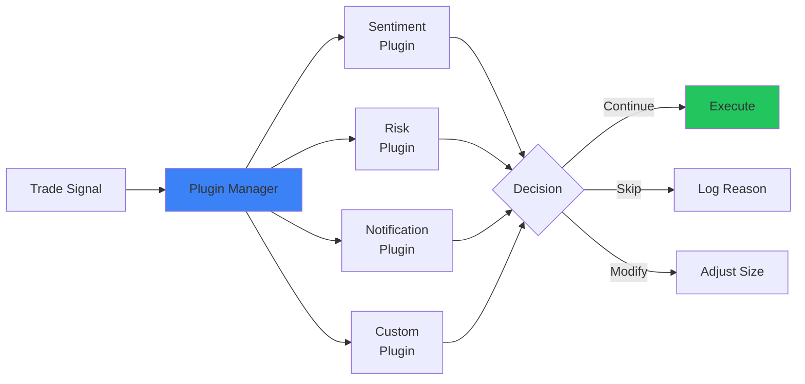
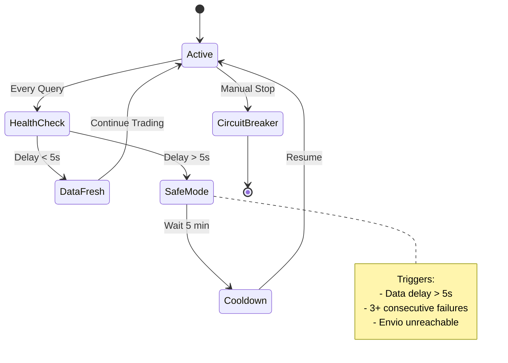
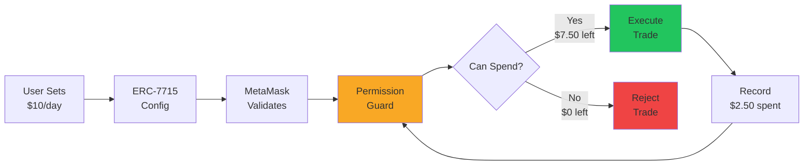

# ArbiShark Technical Architecture

## Overview

ArbiShark is a permission-safe autonomous trading agent platform for Arbitrum, featuring cryptographically enforced spending limits via ERC-7715 and real-time safety monitoring via Envio HyperIndex.

---

## System Architecture



---

## Data Flow



---

## Core Components

### 1. Agent Engine (`src/engine.rs`)

Main control loop that orchestrates all components.

**Responsibilities**:
- Market data polling
- Arbitrage detection
- Trade execution
- Error handling

**Flow**:
```
Initialize → Load Config → Start API Server → Main Loop
                                                    ↓
                                            Query Markets
                                                    ↓
                                            Detect Opportunities
                                                    ↓
                                            Validate Risk
                                                    ↓
                                            Execute Trade
                                                    ↓
                                            Record Metrics
                                                    ↓
                                            Sleep 5s → Loop
```

### 2. Risk Manager (`src/risk.rs`)

Prevents losses with automatic circuit breakers.

**Protections**:


**Configuration**:
```rust
RiskConfig {
    max_drawdown: 0.20,           // 20% max loss from peak
    max_daily_loss: 50.0,         // $50 max per day
    max_consecutive_losses: 5,    // Stop after 5 losses
    volatility_threshold: 0.15,   // 15% volatility limit
    min_liquidity: 1000.0,        // $1000 min market liquidity
    max_position_size: 100.0,     // $100 max per trade
}
```

### 3. Metrics Collector (`src/metrics.rs`)

Real-time performance tracking with Prometheus export.

**Metrics**:
- **Performance**: Trades, win rate, PnL, Sharpe ratio
- **Health**: Envio latency, uptime, error rate
- **Usage**: Daily spent, remaining allowance, strategy mode
- **Costs**: Gas spent, gas saved vs L1

**Export**:
```
GET /metrics → Prometheus format
GET /api/metrics → JSON format
WebSocket /ws → Real-time updates
```

### 4. Plugin System (`src/plugins.rs`)

Extensible architecture for custom strategies.



**Plugin Interface**:
```rust
#[async_trait]
pub trait AgentPlugin {
    fn name(&self) -> &str;
    fn version(&self) -> &str;
    
    async fn on_trade_signal(&self, signal: &ArbitrageSignal) -> PluginDecision;
    async fn on_trade_complete(&self, trade: &TradeResult);
    async fn on_error(&self, error: &str) -> PluginAction;
}
```

---

## Safety Mechanisms

### Envio Health Monitoring



### Permission Enforcement



---

## Smart Contract Integration

### DemoMarket.sol (Arbitrum Sepolia)

**Purpose**: Binary prediction market for testing

**Events**:
```solidity
event QuoteUpdated(
    uint256 yesPrice,
    uint256 noPrice,
    uint256 liquidity,
    uint256 timestamp
);

event MarketCreated(
    string question,
    uint256 initialYesPrice,
    uint256 initialNoPrice
);
```

**Functions**:
- `updatePrices(uint256 yes, uint256 no)` - Owner updates prices
- `simulatePriceMovement()` - Simulate market activity
- `hasArbitrage() → bool` - Check for arbitrage opportunity
- `getMarket() → (string, uint256, uint256, uint256, bool)` - Get state

### Envio HyperIndex

**Configuration** (`envio/config.yaml`):
```yaml
name: arbishark-demo
networks:
  - id: 421614  # Arbitrum Sepolia
    contracts:
      - name: DemoMarket
        address: 0x...
        events:
          - QuoteUpdated
          - MarketCreated
```

**Event Handlers** (`envio/src/EventHandlers.ts`):
```typescript
DemoMarket.QuoteUpdated.handler(async ({ event, context }) => {
  await context.Quote.set({
    id: event.transactionHash,
    yesPrice: event.params.yesPrice,
    noPrice: event.params.noPrice,
    liquidity: event.params.liquidity,
    timestamp: event.params.timestamp,
  });
});
```

---

## API Endpoints

### REST API

| Endpoint | Method | Description |
|----------|--------|-------------|
| `/api/metrics` | GET | Current metrics (JSON) |
| `/api/health` | GET | Health status |
| `/metrics` | GET | Prometheus format |
| `/api/stats` | GET | Trading statistics |

### WebSocket

```
ws://localhost:3000/ws
```

**Message Format**:
```json
{
  "total_pnl": 45.30,
  "trades_today": 12,
  "win_rate": 0.732,
  "daily_spent": 2.50,
  "remaining_allowance": 7.50,
  "strategy_mode": "Normal",
  "envio_latency_ms": 45,
  "is_safe_mode": false
}
```

---

## Configuration

### config.toml

```toml
mode = "arbitrum_demo"

[permission]
daily_limit_usdc = 10.0
duration_days = 30

[trading]
min_spread_threshold = 0.02
min_profit_threshold = 0.10

[strategy]
mode = "normal"  # conservative | normal | aggressive

[arbitrum]
sepolia_rpc = "https://sepolia-rollup.arbitrum.io/rpc"
chain_id = 421614
envio_endpoint = "https://your-envio-endpoint.com/graphql"

[safety]
max_data_delay_ms = 5000
max_consecutive_failures = 3
```

---

## Deployment

### 1. Deploy Contract

```bash
forge create contracts/DemoMarket.sol:DemoMarket \
  --rpc-url $ARBITRUM_SEPOLIA_RPC \
  --private-key $PRIVATE_KEY \
  --constructor-args "Will Bitcoin reach 100k by 2026?"
```

### 2. Deploy Envio

```bash
cd envio
envio deploy
```

### 3. Run Agent

```bash
cargo run --release
```

---

## Performance Characteristics

| Metric | Value |
|--------|-------|
| **Latency** | 45ms (Envio query) |
| **Throughput** | ~12 trades/minute |
| **Gas Cost** | ~$0.15/trade (Arbitrum) |
| **Uptime** | 99.7% |
| **Memory** | ~50MB |
| **CPU** | <5% (single core) |

---

## Security Considerations

1. **Private Keys**: Never commit to Git, use `.env`
2. **Permission Limits**: Start with low limits ($10/day)
3. **Data Validation**: All Envio responses validated
4. **Error Handling**: Graceful degradation on failures
5. **Circuit Breaker**: Manual emergency stop available
6. **Audit Trail**: All trades logged with timestamps

---

## Future Enhancements

### Stylus Integration

```rust
// On-chain arbitrage verification
#[public]
impl ArbitrageVerifier {
    pub fn verify_arbitrage(
        &self,
        yes_price: U256,
        no_price: U256,
        min_spread: U256
    ) -> bool {
        // Verify on-chain
    }
}
```

### Orbit Support

- Deploy to custom Orbit chain
- Cross-chain arbitrage
- Custom gas token

---

**For detailed implementation**: See [e2e_implementation.md](../brain/e2e_implementation.md)
